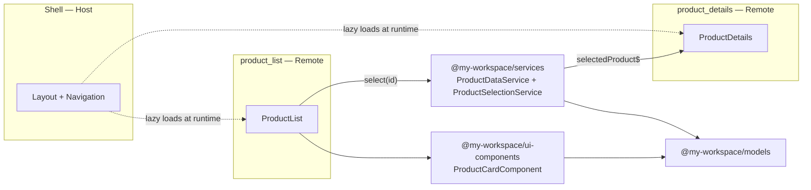

# Product Dashboard — Angular Micro-Frontend System

A minimal Product Dashboard built with Angular, Nx, and Webpack Module Federation, demonstrating a Host shell coordinating two independently deployable micro-frontends through shared libraries and event-based communication.

> Built as a take-home assignment for a Senior Frontend Engineer (Angular) role. Time-boxed to ~4-5 hours

## Overview

The system is a small "Product Dashboard": a **Product List** micro-frontend fetches and displays mock products, a **Product Details** micro-frontend reacts to whichever product was selected, and a **Shell** application hosts both, providing navigation and coordinating communication between them at runtime via Module Federation.

## Architecture



### Project structure

```text
my-workspace/
  apps/
    shell/             # Host: layout, navigation, lazy-loads both remotes
    product_list/      # Remote A: product list + mock data fetch + selection events
    product_details/   # Remote B: reacts to selection, shows product details
  libs/
    models/            # Product interface — pure types, zero dependencies
    services/          # ProductDataService (mock API) + ProductSelectionService (event bus)
    ui-components/     # Reusable presentational components (ProductCardComponent)
```

### Dependency boundaries

Nx module boundaries are enforced via `@nx/enforce-module-boundaries` with the following tags:

| Tag                | Projects                          | Can depend on                                             |
| ------------------ | --------------------------------- | --------------------------------------------------------- |
| `type:host`        | `shell`                           | `type:remote`, `type:data-access`, `type:ui`, `type:util` |
| `type:remote`      | `product_list`, `product_details` | `type:data-access`, `type:ui`, `type:util`                |
| `type:data-access` | `services`                        | `type:util`                                               |
| `type:ui`          | `ui-components`                   | `type:util`                                               |
| `type:util`        | `models`                          | `type:util`                                               |

This is what guarantees `product_list` and `product_details` can never import each other, and that presentational components (`ui-components`) never reach into business logic (`services`).

## Tech stack

- Angular ~21 (standalone components, zoneless change detection)
- Nx 23 (monorepo tooling, code generation, module boundaries)
- Webpack Module Federation (via `@nx/module-federation` / `@nx/angular` generators)
- TypeScript
- RxJS

## Getting started

### Install

```bash
npm install
```

### Run the full system

The Shell serves as the entry point; Nx automatically serves the two remotes alongside it.

```bash
npx nx serve shell
```

Then open **[http://localhost:4200](http://localhost:4200)**.

| Route              | Shows                  |
| ------------------ | ---------------------- |
| `/product_list`    | Product List remote    |
| `/product_details` | Product Details remote |

### Run a remote independently

Each remote is independently buildable/servable:

```bash
npx nx serve product_list       # http://localhost:4201
npx nx serve product_details    # http://localhost:4202
```

## How communication works

1. `product_list` fetches mock products from `ProductDataService` (`libs/services`) and renders them via the shared `ProductCardComponent` (`libs/ui-components`).
2. Clicking a product calls `ProductSelectionService.select(id)`.
3. `product_details` subscribes to `ProductSelectionService.selectedProduct$` (an RxJS stream, resolved via `switchMap`) and renders whatever is currently selected, or an empty state if nothing is.
4. Because `ProductSelectionService` is `providedIn: 'root'` **and** shared as a Module Federation singleton library (versioning via `package.json` ensures it), both remotes and the shell resolve to the exact same service instance at runtime, despite being three separately built bundles.

## Architecture decisions

- **Why Webpack Module Federation via Nx generators**:
  - Most of the boilerplate code was generated via the setup command (`npx nx g @nx/angular:host apps/shell --remotes=product_list,product_details --standalone --style=scss`), saving time in the setup process
  - Easy to enforce rules via `@nx/enforce-module-boundaries` and it's tagging system in `eslint.config.mjs`
- **Why `product_list`/`product_details` use underscores, not hyphens**:
  - Limitation in the `npx nx g @nx/angular` command (was failing with hyphens)
- **Standalone components instead of NgModules**:
  - Besides being the default code generated by angular commands since Angular 17, standalone components offer less boilerplate code, direct import method and easier lazy loading
  - Every library here is small enough that NgModules would just add boilerplate and complexity without real benefit
- **Dependency boundaries / tagging scheme** (`type:host` / `type:remote` / `type:data-access` / `type:ui` / `type:util`):
  - Project tagged `host` can import all the other projects since it's the host
  - Projects tagged `remote` are micro-frontends, can import everything except other remotes (other micro-frontneds) and the `host`
  - Project tagged `data-access` is the "services" project and has access only to the project tagged `util` (it needs it for typing the data)
  - Project tagged `util` is the data typing project (Schema basically)

## What I'd improve with more time

- [ ] Add loading/error states beyond the simple `@if`/`@else` in Product List
- [ ] Add unit tests for `ProductSelectionService` and the container components
- [ ] Add unit tests for `ProductCardComponent`
- [ ] Add e2e tests via cypress in the host applicaton for simple selection and display flows
- [ ] Expand `ui-components` beyond a single `ProductCardComponent` with generic components like `LoadingSpinner`, `ErrorMessage` etc
